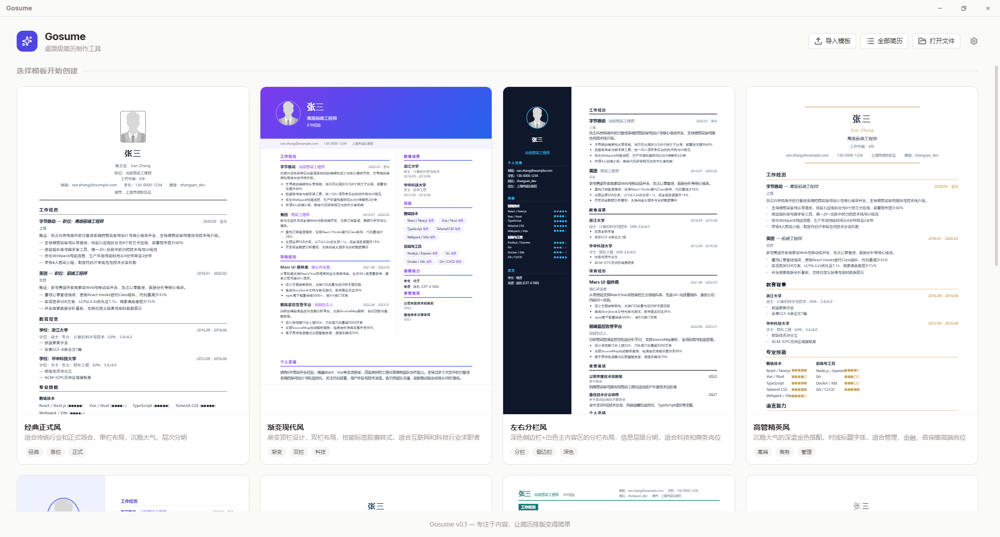
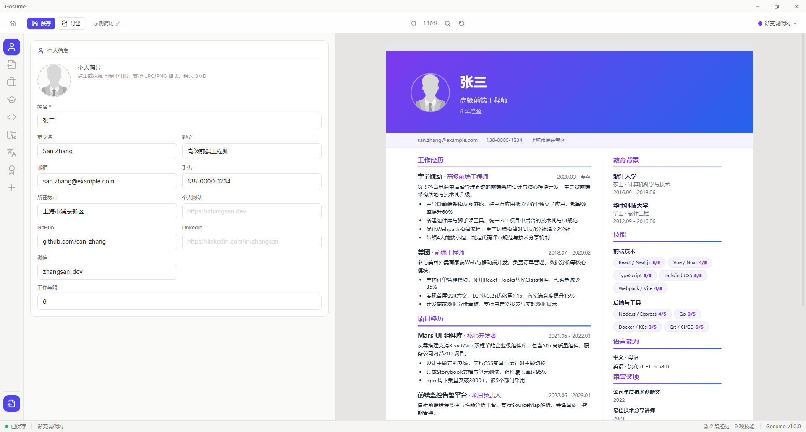
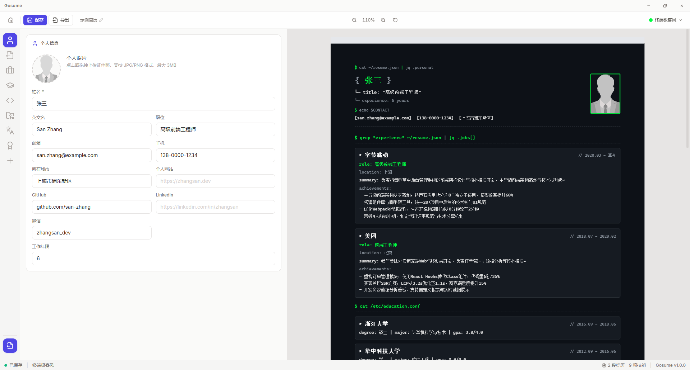
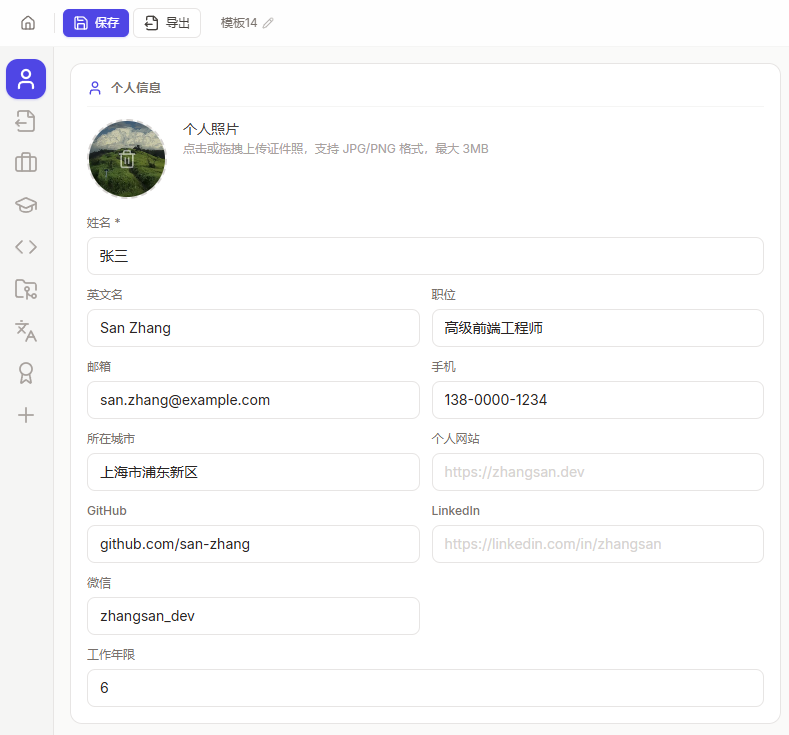
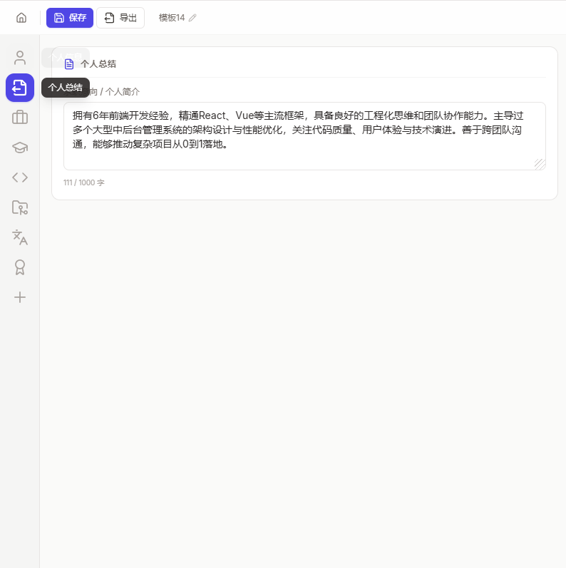
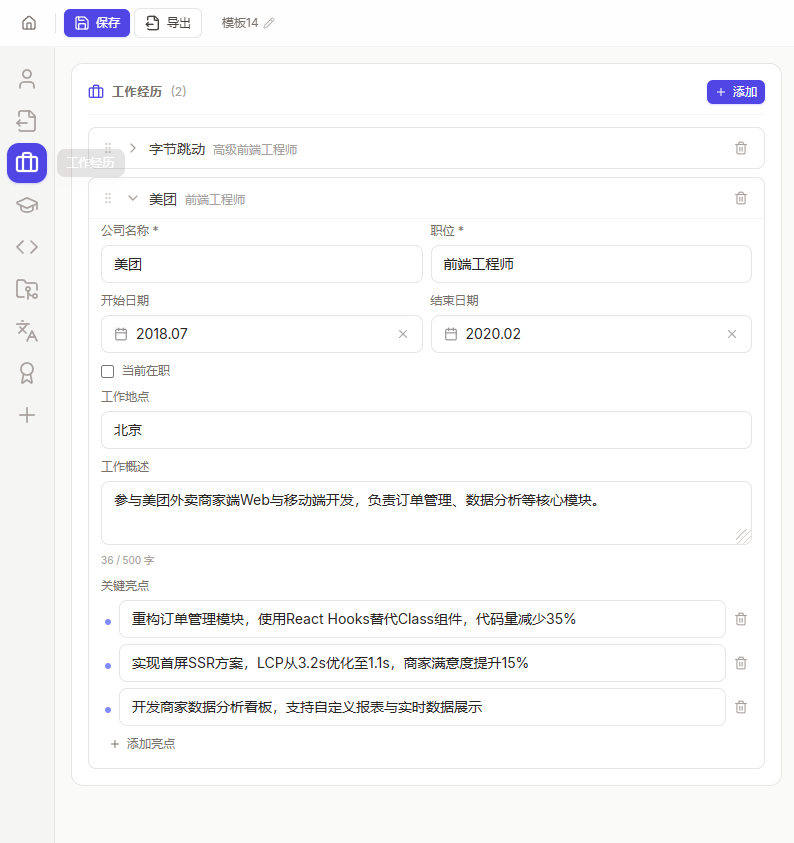
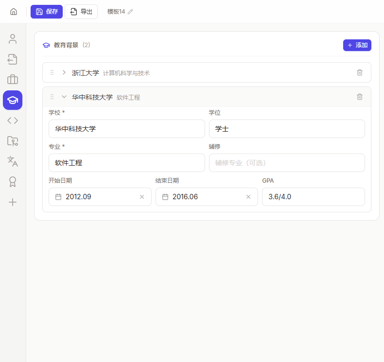
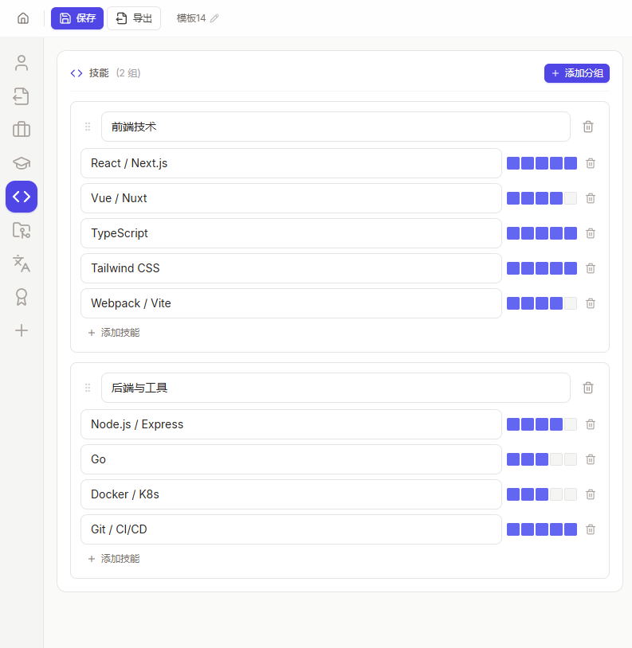

# Gosume

<div align="center">

[](#中文) &nbsp;&nbsp; [](#english)

</div>

---

## 中文

**Gosume** 是一款简洁、专业的桌面端简历制作工具。无需排版知识，无需打开 Word——选择模板、填写内容、一键导出，三步搞定一份高质量简历。



### 为什么选择 Gosume

- **所见即所得** — 编辑内容即时渲染为最终效果，告别反复调整格式的痛苦。
- **16 套精选模板** — 从经典正式风到极客终端风，覆盖互联网、金融、设计、学术等各类求职场景，每套模板都经过精心调校。
- **一键导出** — 支持 PDF、DOCX、PNG 三种格式，可根据需要调节纸张大小、缩放比例和页码范围。
- **自动保存，永不丢失** — 所有内容自动持久化到本地数据库，即使意外关闭也能完整恢复。
- **跨平台使用** — 支持 Windows、macOS、Linux 桌面端，以及 iOS / Android 移动端，随时随地编辑简历。

### 模板一览

| 模板 | 风格 | 适用场景 |
|------|------|----------|
| 经典正式风 | 单栏、沉稳大气 | 传统行业、国企、正式场合 |
| 现代专业风 | 双栏、简洁科技 | 互联网、科技行业 |
| 创意设计风 | 侧边栏、色彩鲜明 | 设计、创意、市场类岗位 |
| 极简清新风 | 留白多、干净利落 | 外企、追求简洁风格 |
| 紧凑高效风 | 信息密度高、一页容纳 | 经验丰富、内容较多 |
| 高管精英风 | 权威感、稳重 | 管理岗位、资深人士 |
| 学术简历风 | 严谨规范 | 高校、科研机构 |
| 渐变现代风 | 渐变色、年轻活力 | 新兴行业、创业公司 |
| 黑金锋范风 | 高对比、霸气 | 高端职位、彰显个性 |
| 水墨丹青风 | 中式美学 | 文化创意、教育行业 |
| 青叶自然风 | 清新自然色调 | 环保、教育、NGO |
| 瑞士国际风 | 网格系统、排版考究 | 国际化企业、追求设计感 |
| 左右分栏风 | 双栏分明 | 内容模块清晰分类 |
| 时间线叙事风 | 时间轴布局 | 强调成长轨迹的岗位 |
| 日式禅意风 | 极简留白 | 日企、偏爱侘寂美学 |
| 终端极客风 | 命令行风格 | 开发者、技术极客 |





### 编辑体验











### 功能亮点

- **拖拽排序** — 拖拽即可调整模块和条目的展示顺序。
- **键盘快捷键** — 完整键盘操作支持，提升编辑效率。
- **示例数据** — 一键填充示例，快速体验模板效果，满意后再填入真实信息。
- **项目文件** — 支持保存和打开 `.resume.json` 文件，便于归档和多版本管理。
- **自定义模板** — 有设计能力？可将自定义模板放入模板目录即可使用。
- **本地优先** — 所有数据存储于本地，无需网络连接，隐私安全。

### 下载安装

请前往 [Releases](https://github.com/muyu0211/Gosume/releases) 页面下载对应平台的安装包。

| 平台 | 格式 |
|------|------|
| Windows | `.exe` / `.msi` |
| macOS | `.dmg` |
| Linux | `.AppImage` / `.deb` |

### 开发相关

**环境要求：** Go 1.25+、Node.js 18+

```bash
# 安装前端依赖
cd frontend && npm install && cd ..

# 启动开发模式
task dev

# 构建打包
task build && task package
```

项目基于 [Wails v3](https://wails.io) 构建，采用 MIT 协议开源。欢迎提交 Issue 和 PR。

---

## English

**Gosume** is a clean, professional desktop resume builder. Pick a template, fill in your details, export — three steps to a polished resume, no design skills needed.


### Why Gosume

- **WYSIWYG** — What you see is what you get. Every edit renders instantly as the final output.
- **16 Handcrafted Templates** — From classic formal to terminal hacker style, covering tech, finance, design, academia, and more.
- **One-Click Export** — Export to PDF, DOCX, or PNG with adjustable paper size, scale, and page range.
- **Auto-Save** — All changes are persisted locally. Close the app anytime — your work is safe.
- **Cross-Platform** — Available on Windows, macOS, Linux desktop, plus iOS / Android mobile.

### Templates

| Template | Style | Best For |
|----------|-------|----------|
| Classic Formal | Single-column, timeless | Traditional industries, conservative settings |
| Modern Professional | Two-column, clean | Tech, startups |
| Creative Designer | Sidebar, bold colors | Design, marketing, creative roles |
| Minimal Clean | Ample whitespace | Corporate, modern workplaces |
| Compact Efficient | High density, one-page | Senior professionals with rich experience |
| Executive Elite | Authoritative, refined | Management, executive roles |
| Academic Scholar | Structured, formal | Universities, research institutions |
| Gradient Modern | Vibrant gradients | Emerging industries, startups |
| Bold Authority | High contrast, striking | Senior roles, standout applications |
| Ink Wash | Chinese ink-painting aesthetic | Cultural, creative, education sectors |
| Natural Leaf | Fresh, earthy tones | Environmental, education, NGO |
| Swiss International | Grid system, typography-focused | Global companies, design-conscious roles |
| Split Panel | Distinct two-column layout | Clear content categorization |
| Timeline Narrative | Timeline-based layout | Career progression focus |
| Zen Minimalist | Minimalist wabi-sabi | Japanese companies, minimalist aesthetic |
| Terminal Hacker | Command-line style | Developers, tech enthusiasts |


### Editing Experience


### Highlights

- **Drag & Drop** — Reorder sections and items with a simple drag.
- **Keyboard Shortcuts** — Full keyboard navigation for efficient editing.
- **Sample Data** — Fill sample data in one click to preview templates before adding your own.
- **Project Files** — Save and open `.resume.json` files for archiving and version control.
- **Custom Templates** — Bring your own templates by placing them in the templates directory.
- **Local-First** — All data stays on your device. No internet required, your privacy is protected.

### Download

Visit the [Releases](https://github.com/muyu0211/Gosume/releases) page to download the installer for your platform.

| Platform | Format |
|----------|--------|
| Windows | `.exe` / `.msi` |
| macOS | `.dmg` |
| Linux | `.AppImage` / `.deb` |

### Development

To build from source:

**Prerequisites:** Go 1.25+, Node.js 18+

```bash
cd frontend && npm install && cd ..
task dev        # development mode
task build && task package  # production build
```

Built with [Wails v3](https://wails.io). Licensed under [MIT](LICENSE). Issues and PRs welcome.

---

<div align="center">

**Gosume** — 你的简历，你来做主 / Your resume, crafted.

</div>
