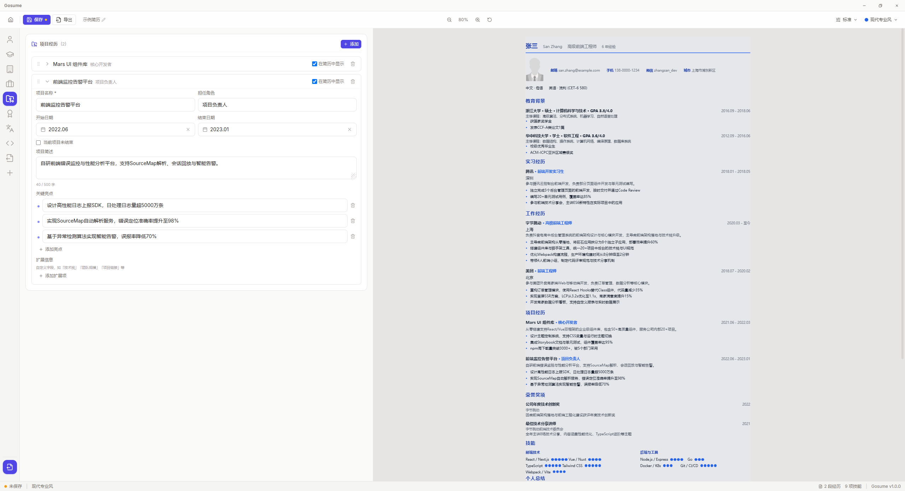

# 一期改造bug单

##  一、简历编辑页bug
### 1. 在简历编辑页面中，简历渲染时分页不生效 **P0**
内容已经明显超出一页A4纸范围，但是渲染出的简历所有内容挤在一页中，导出为pdf时有分页。 但是分页较为生硬，观感为直接截断，而不是正常分页。（可能是pdf的行为，而不是gosume的分页算法进行的分页）

### 2. 页边距调整已经失效 **P0**
简历编辑页实时渲染的简历没有页边距，内容直接贴着页边。（但是原本是双栏的模板存在页边距，虽然也调整不了）

### 3. 双栏简历在主页面正常渲染为双栏 **P0**
改造前为双栏的简历模板在主页面正常渲染为双栏，但是在简历编辑页面渲染为单栏，并且内容被挤到一页中。且有页边距但是页边距调整失效（已描述在<1.2>中），简历页面为灰色，而非纯白色

## 二、主页面bug
### 1. 在主页面小屏渲染时，简历渲染行为与编辑页面不一致 **P0**
在小屏渲染时，简历渲染行为与编辑页面不一致，已在<1.3>中提到，小屏渲染效果与改造前渲染效果较为一致，但是与简历编辑页完全不一致：
小屏渲染有页边距样式，且双栏模板渲染正常；
页面为正常纯白色，与简历编辑页也不一致；

## 三、模板样式bug
### 1. 简历模板的图像位置错误 **P1**
改造前大多数简历模板的图像位置都是在右侧，但是改造后，图像位置被拉到左侧中，且与邮箱、手机等组件挤在一块。

## 目前正常的逻辑
### 1.导出功能正常，但是导出的简历样式不正常，已在上述bug中提及
### 2.简历内容间距调整正常，但是页边距调整失效，已在上述bug中提及
### 3.组件显隐逻辑正常
### 4.条目拖动排序渲染逻辑正常
### 5.内容编辑（包括头像）并保存逻辑正常

## 综合来看，当前gosume主要存在渲染逻辑的bug，内容编辑的主链路不受影响

